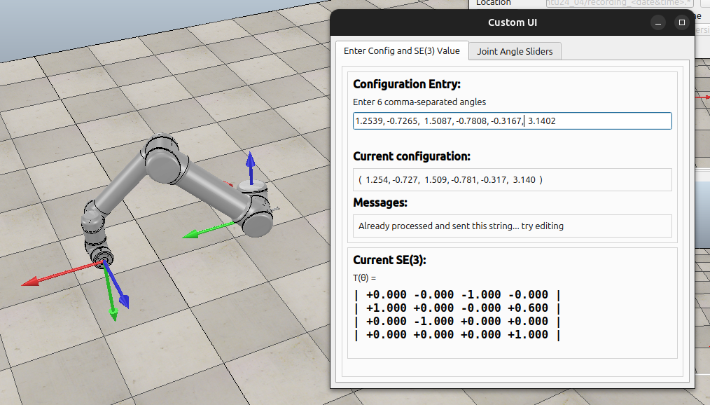
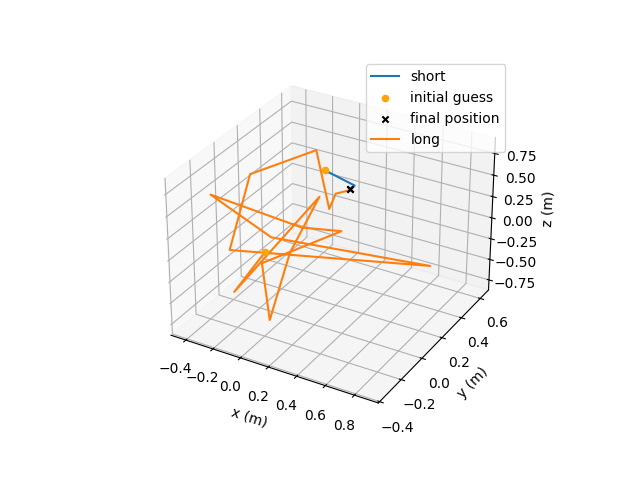
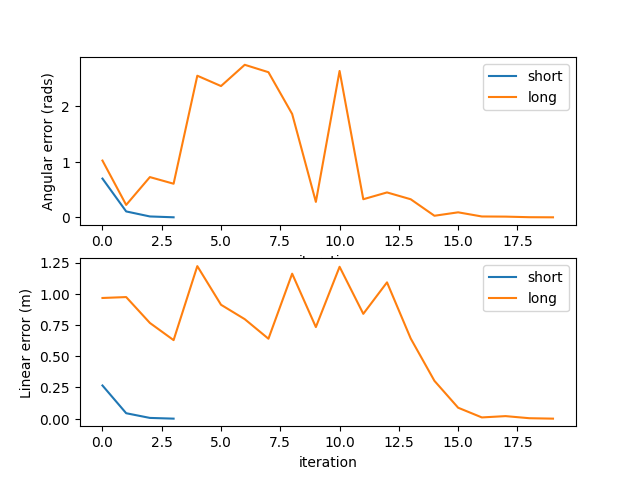
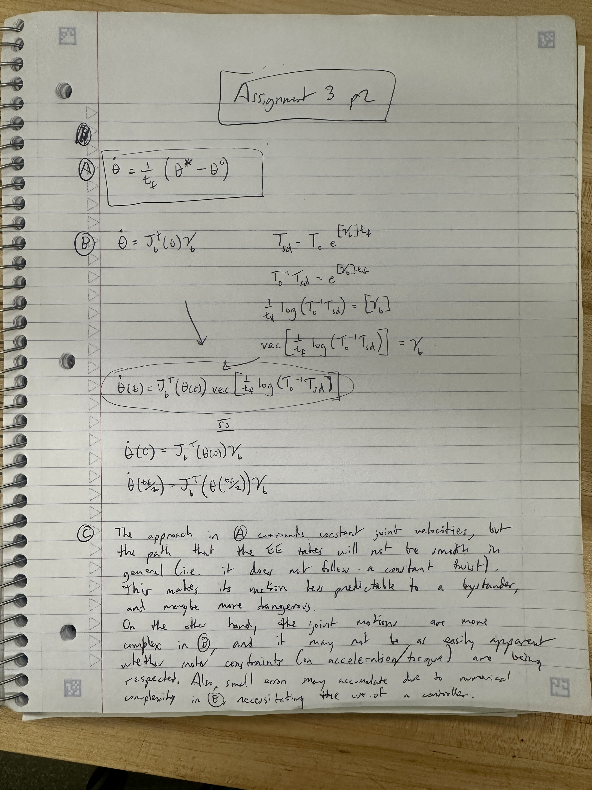

# ME449 Assignment 3

## Assignment submission contents:
1. PDF file (this file) -- see sections below
2. commented code is contained in `code` directory
3. output CSV's are in the top-level submission zip, and also placed in `code/output/*` when the code is run
4. see #3
5. videos are in the top-level submission zip

## Running the code
### using `uv` (no virtualenv needed)
```
uv sync
uv run assignment_3.py
```

### using `pip` (recommended: use virtualenv)
```
pip install -r requirements.txt
python assignment_3.py
```

## 1.1 Screen Log for both short & long initial guesses
```
(.venv) ➜  lynch-python-work git:(assignment_3.py) ✗ uv run assignment_3.py
***************SHORT GUESS**************
Iteration 0:


joint vector:
[ 1.23 -0.68  1.34 -0.38 -0.28  2.85]

SE(3) end-effector config:
[[ 0.07 -0.07 -0.99  0.02]
 [ 1.    0.03  0.07  0.62]
 [ 0.03 -1.    0.08  0.03]
 [ 0.    0.    0.    1.  ]]

error twist V_b:
[-0.08 -0.07  0.03 -0.02  0.03  0.02]

angular error:   0.106
 linear error:   0.043

Iteration 1:


joint vector:
[ 1.26 -0.74  1.52 -0.81 -0.3  -3.11]

SE(3) end-effector config:
[[ 0.01  0.01 -1.   -0.  ]
 [ 1.   -0.    0.01  0.6 ]
 [-0.   -1.   -0.01  0.01]
 [ 0.    0.    0.    1.  ]]

error twist V_b:
[ 0.01 -0.01 -0.    0.    0.01 -0.  ]

angular error:   0.015
 linear error:   0.006

Iteration 2:


joint vector:
[ 1.25 -0.73  1.51 -0.78 -0.32  3.14]

SE(3) end-effector config:
[[ 0.  -0.  -1.   0. ]
 [ 1.   0.   0.   0.6]
 [ 0.  -1.   0.   0. ]
 [ 0.   0.   0.   1. ]]

error twist V_b:
[-0. -0.  0.  0.  0.  0.]

angular error:   0.0
 linear error:   0.0

//////theta_d short (CONVERGED): 
[ 1.2539 -0.7265  1.5087 -0.7808 -0.3167  3.1402]
***************LONG GUESS**************
Iteration 0:


joint vector:
[-1.92  1.77 -2.19 -0.24  2.82  2.47]

SE(3) end-effector config:
[[ 0.1  -0.19 -0.98 -0.09]
 [ 0.99  0.06  0.09 -0.34]
 [ 0.04 -0.98  0.19 -0.23]
 [ 0.    0.    0.    1.  ]]

error twist V_b:
[-0.19 -0.1   0.05  0.95 -0.21 -0.02]

angular error:   0.223
 linear error:   0.974

Iteration 1:


joint vector:
[-2.43 -2.62  1.67  1.89  2.46 -2.15]

SE(3) end-effector config:
[[ 0.48  0.39 -0.79  0.17]
 [ 0.86 -0.36  0.35  0.09]
 [-0.15 -0.85 -0.51  0.52]
 [ 0.    0.    0.    1.  ]]

error twist V_b:
[ 0.49 -0.45 -0.28  0.52  0.39  0.41]

angular error:   0.723
 linear error:   0.767

Iteration 2:


joint vector:
[-1.12  2.04 -2.66  1.84 -2.89 -1.55]

SE(3) end-effector config:
[[-0.41 -0.07 -0.91  0.04]
 [ 0.84 -0.43 -0.34 -0.02]
 [-0.37 -0.9   0.23 -0.08]
 [ 0.    0.    0.    1.  ]]

error twist V_b:
[-0.16  0.4  -0.42  0.59 -0.21 -0.07]

angular error:   0.604
 linear error:   0.629

Iteration 3:


joint vector:
[ 2.07  1.45  0.25 -1.12 -1.96 -2.93]

SE(3) end-effector config:
[[-0.59  0.4   0.71 -0.01]
 [-0.81 -0.32 -0.49 -0.14]
 [ 0.03 -0.86  0.51 -0.76]
 [ 0.    0.    0.    1.  ]]

error twist V_b:
[-0.26  2.44 -0.66  0.07 -1.01 -0.68]

angular error:   2.545
 linear error:   1.222

Iteration 4:


joint vector:
[ 1.91  2.6  -2.69  1.32  1.29 -0.05]

SE(3) end-effector config:
[[-0.86 -0.35 -0.37 -0.11]
 [-0.45  0.87  0.21 -0.08]
 [ 0.25  0.34 -0.91 -0.2 ]
 [ 0.    0.    0.    1.  ]]

error twist V_b:
[ 0.93  1.09  1.87  0.48  0.61 -0.48]

angular error:   2.359
 linear error:   0.912

Iteration 5:


joint vector:
[-2.26  2.07  2.16 -0.82 -1.14 -2.56]

SE(3) end-effector config:
[[ 0.71 -0.66 -0.24  0.29]
 [-0.34 -0.02 -0.94  0.13]
 [ 0.62  0.75 -0.24  0.13]
 [ 0.    0.    0.    1.  ]]

error twist V_b:
[-1.51  0.83  2.13  0.1   0.76 -0.21]

angular error:   2.741
 linear error:   0.797

Iteration 6:


joint vector:
[-1.22  2.8  -2.95  1.54 -2.3   0.66]

SE(3) end-effector config:
[[-0.31  0.67 -0.67  0.01]
 [-0.85 -0.51 -0.11  0.13]
 [-0.41  0.54  0.73  0.05]
 [ 0.    0.    0.    1.  ]]

error twist V_b:
[-0.16  1.09 -2.37  0.23 -0.54 -0.25]

angular error:   2.608
 linear error:   0.64

Iteration 7:


joint vector:
[ 0.41 -1.46 -1.58 -2.22 -2.78  3.13]

SE(3) end-effector config:
[[-0.58 -0.79  0.21 -0.42]
 [ 0.13 -0.34 -0.93 -0.15]
 [ 0.81 -0.51  0.3   0.52]
 [ 0.    0.    0.    1.  ]]

error twist V_b:
[-1.05  1.46  0.45  0.12  0.29 -1.12]

angular error:   1.858
 linear error:   1.162

Iteration 8:


joint vector:
[-2.05 -1.55  3.1   2.14 -2.59  0.53]

SE(3) end-effector config:
[[ 0.01  0.27 -0.96 -0.01]
 [ 1.   -0.05 -0.   -0.11]
 [-0.05 -0.96 -0.27  0.18]
 [ 0.    0.    0.    1.  ]]

error twist V_b:
[ 0.27 -0.01 -0.05  0.72  0.16  0.01]

angular error:   0.277
 linear error:   0.734

Iteration 9:


joint vector:
[ 0.04 -0.13  0.51 -0.7   0.86  2.21]

SE(3) end-effector config:
[[ 0.13  0.71  0.7   0.87]
 [-0.45 -0.58  0.68  0.2 ]
 [ 0.88 -0.4   0.24 -0.07]
 [ 0.    0.    0.    1.  ]]

error twist V_b:
[ 1.25 -2.17  0.81 -0.62 -0.68  0.8 ]

angular error:   2.631
 linear error:   1.217

Iteration 10:


joint vector:
[ 1.35  1.63  2.75 -3.04 -0.19  1.62]

SE(3) end-effector config:
[[ 0.21 -0.15 -0.97 -0.24]
 [ 0.96  0.21  0.17 -0.2 ]
 [ 0.18 -0.97  0.18  0.03]
 [ 0.    0.    0.    1.  ]]

error twist V_b:
[-0.17 -0.19  0.2   0.82  0.09 -0.17]

angular error:   0.325
 linear error:   0.84

Iteration 11:


joint vector:
[ 1.92 -0.96 -1.37 -0.81  0.1  -0.05]

SE(3) end-effector config:
[[-0.43 -0.02 -0.9  -0.17]
 [ 0.9   0.05 -0.43 -0.1 ]
 [ 0.05 -1.    0.    0.82]
 [ 0.    0.    0.    1.  ]]

error twist V_b:
[-0.01  0.44  0.05  0.63  0.83 -0.32]

angular error:   0.447
 linear error:   1.092

Iteration 12:


joint vector:
[-1.25 -3.09  1.53 -1.42  2.82 -0.16]

SE(3) end-effector config:
[[ 0.01 -0.05 -1.   -0.11]
 [ 0.95  0.31 -0.    0.42]
 [ 0.31 -0.95  0.05  0.6 ]
 [ 0.    0.    0.    1.  ]]

error twist V_b:
[-0.05 -0.    0.32  0.09  0.62 -0.12]

angular error:   0.325
 linear error:   0.642

Iteration 13:


joint vector:
[-1.68  1.85  2.23 -0.73 -3.04  0.22]

SE(3) end-effector config:
[[ 0.01  0.02 -1.    0.06]
 [ 1.   -0.01  0.01  0.32]
 [-0.01 -1.   -0.02  0.09]
 [ 0.    0.    0.    1.  ]]

error twist V_b:
[ 0.02 -0.01 -0.01  0.28  0.09  0.07]

angular error:   0.028
 linear error:   0.303

Iteration 14:


joint vector:
[-1.4   2.13  1.43  0.13  2.98  0.56]

SE(3) end-effector config:
[[-0.03 -0.08 -1.   -0.06]
 [ 1.   -0.01 -0.03  0.54]
 [-0.01 -1.    0.08 -0.02]
 [ 0.    0.    0.    1.  ]]

error twist V_b:
[-0.08  0.03 -0.01  0.06 -0.02 -0.06]

angular error:   0.09
 linear error:   0.088

Iteration 15:


joint vector:
[-1.54  2.26  1.28  0.05  3.11  0.45]

SE(3) end-effector config:
[[-0.01 -0.01 -1.    0.01]
 [ 1.   -0.01 -0.01  0.59]
 [-0.01 -1.    0.01  0.  ]
 [ 0.    0.    0.    1.  ]]

error twist V_b:
[-0.01  0.01 -0.01  0.01  0.    0.01]

angular error:   0.015
 linear error:   0.01

Iteration 16:


joint vector:
[-1.53  2.11  1.47 -0.71  3.1  -0.27]

SE(3) end-effector config:
[[-0.01  0.01 -1.   -0.  ]
 [ 1.    0.   -0.01  0.6 ]
 [ 0.   -1.   -0.01 -0.02]
 [ 0.    0.    0.    1.  ]]

error twist V_b:
[ 0.01  0.01  0.   -0.   -0.02 -0.  ]

angular error:   0.012
 linear error:   0.02

Iteration 17:


joint vector:
[-1.53  2.17  1.4  -0.4   3.1   0.03]

SE(3) end-effector config:
[[-0.  -0.  -1.  -0. ]
 [ 1.  -0.  -0.   0.6]
 [-0.  -1.   0.  -0. ]
 [ 0.   0.   0.   1. ]]

error twist V_b:
[-0.  0. -0.  0. -0. -0.]

angular error:   0.002
 linear error:   0.004

Iteration 18:


joint vector:
[-1.53  2.17  1.41 -0.44  3.1  -0.  ]

SE(3) end-effector config:
[[-0.   0.  -1.   0. ]
 [ 1.   0.  -0.   0.6]
 [ 0.  -1.  -0.  -0. ]
 [ 0.   0.   0.   1. ]]

error twist V_b:
[ 0.  0.  0.  0. -0.  0.]

angular error:   0.0
 linear error:   0.0

//////theta_d long (CONVERGED): 
[-1.5256e+00  2.1726e+00  1.4071e+00 -4.3900e-01  3.0965e+00 -9.0000e-04]
```

## 1.3 Copelliasim screenshot


## 1.4 Figure of EE progession


## 1.5/1.6 Figure of linear + angular error


## 1.7 Why convergence is difficult from the long iterates initial guess
Convergence is difficult here because the angles in the initial guess are all individually very far from the
correct angles which would lead to convergence. This means that Newton-Raphson must bounce around the FK function
many times until it finally ends up in the well that leads to a zero of the function. 

## 1.8


Author: Conor Hayes
